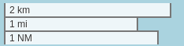
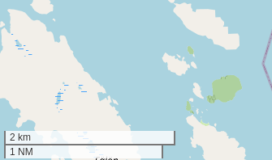
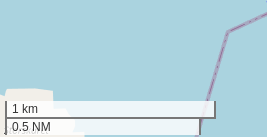

# Leaflet.NauticalScale
Extension to the Leaflet Scale control that adds nautical miles. [Example map](https://danielmartling.github.io/Leaflet.NauticalScale/example/).

## What it does

Adds Nautical Miles (1 NM = 1852 m) to the default [Leaflet scale control](https://leafletjs.com/reference.html#control-scale). Divides nautical miles into tenths (0.1 NM = 1 cable) if necessary.



## Install instructions

1. Clone the repo.
2. Copy `leaflet.nauticalscale.js` to your project. 
3. Include eg. `<script src="src/leaflet.nauticalscale.js"></script>` in the head of your html file.

## Usage example

See the [example map](https://danielmartling.github.io/Leaflet.NauticalScale/example/).

Add the scale to your map:
```
const scale = new L.Control.ScaleNautical().addTo(map);
```

With some options:
```
const scale = new L.Control.ScaleNautical({
    position: "bottomleft",
    metric: true,
    nautical: true,
    maxWidth: 300
}).addTo(map);
```

### Options table

| Option              | Type      | Default      | Description                                                              |
| ------------------- | --------- | ------------ | ------------------------------------------------------------------------ |
| `position`          | `String`  | `bottomleft` | Position of the control on the map.                                      |
| `metric`            | `Boolean` | `true`       | Show the metric scale (meters/kilometers).                               |
| `imperial`          | `Boolean` | `false`      | Show the imperial scale (feet/miles).                                    |
| `nautical`          | `Boolean` | `true`       | Show the nautical scale (NM).                                            |
| `maxWidth`          | `Number`  | `100`        | Maximum width of the scale bar, in pixels.                               |
| `updateWhenIdle`    | `Boolean` | `false`      | If `true`, the control is updated only after the map has stopped moving. |
| `nauticalMilesUnit` | `String`  | `NM`         | Unit label. For example `nm`, `M`, `'`, `NMi`, `sjömil`, etc.            |


## Screenshots
|                                         |                                                                                                 |
| --------------------------------------- | ----------------------------------------------------------------------------------------------- |
| Nautical miles and kilometers           |            |
| Tenths of nautical miles and kilometers |  |
